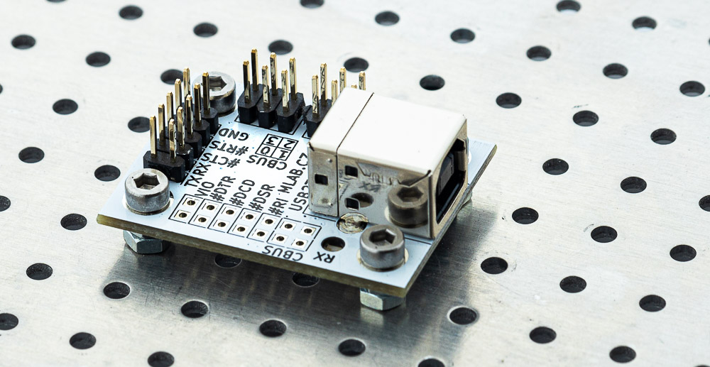
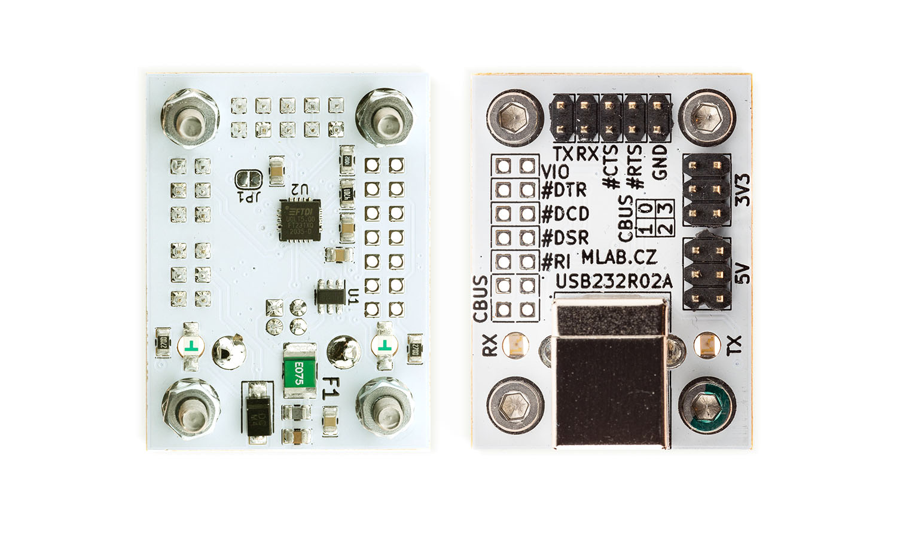

# USB232R02A
The module USB232R02A is a versatile and high-quality converter from USB to serial UART with 3.3V CMOS drive output and TTL input. It features a 5V-tolerant input and utilizes the reliable FT231XQ chip from FTDI The converter uses [FT231XQ](https://ftdichip.com/products/ft231xq/) chip from FTDI, ensuring maximum compatibility with all major operating systems. With supports for Full Speed USB and Full Handshake UART signals. 

The module provides the ability to power your devices via 5V from USB and 3.3V from the integrated power source simultaneously. The protection of the host device for overcurrent is realized by reversible fuse (750mA). 5V header is powerd from USB bus (trought fuse). The 3.3V power source is supplied from an LDO integrated in the FTDI converter. The 3.3V current limit is 50mA.

## What makes this module special?

USB23202A is differ from other USB-UART converters with its compatibility with MLAB standards, this fact will save any engineer or maker o lot of time. One of its key features is a unified dimension and pattern of M3 mounting screws that can be used to create a solid foundation and ground plane for your complex designs, thanks to its aluminum mounting board ALBASEx. This not only ensures mechanical durability but also makes it easy to mount your device into your final designs. With uniform cable wiring methods, this device protects your design from unnecessary malfunctions, providing you with a tool to easily and quickly prototype your high-quality devices. Invest in the USB23202A and take your designs to the next level!

## Parameters

| Parameter | Value | Description |
|-----------|-------|-------------|
| Dimensions | 40,132 x 29,972 mm | PCB dimensions |
| IO | FT231XQ | Original FTDI | 
| Number of UART channels | 1 | Including all control signals | 
| USB speed | Full Speed (12 Mbps) | |
| USB connector | USB-B | USB 2.0 |
| Communication indication | 2x LED UART RX/TX | Purpose of LEDs can be changed |
| USB Class | FTDI driver | Virtual COM port |
| Power source | 5V and 3.3V (50mA) | 3.3V is provided by FT231XQ |

## How to get this device? 

This device is sold by [Universal Scientific Technologies s.r.o.](https://www.ust.cz). If you are interested in our equipment, do not be afraid to [contact us](mailto:sale@ust.cz).

## Schematics

