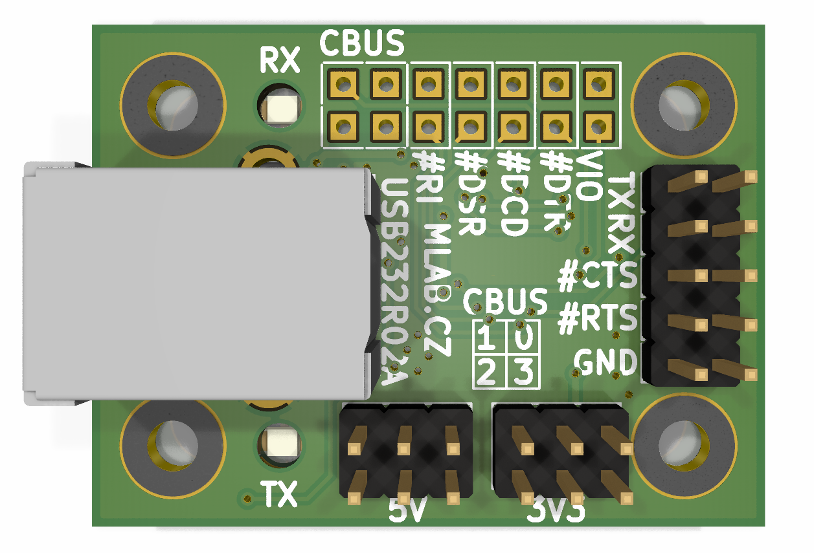
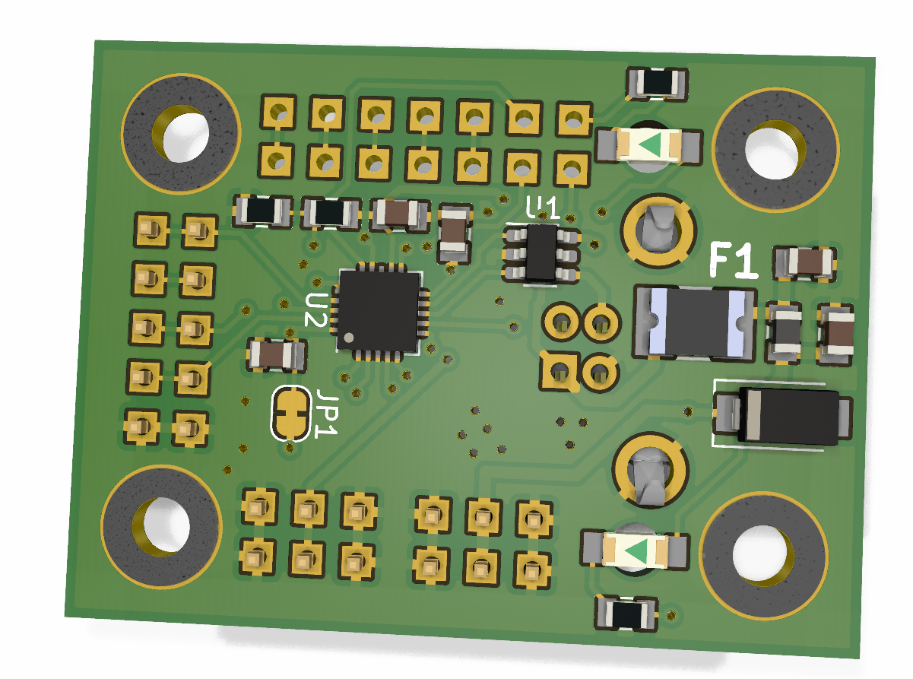

# USB232R02A
The module USB232R02A is universal and high quality converter from USB to serial UART with  3.3V CMOS drive output and TTL input. Input is 5V tolerant. The converter uses [FT231XQ](https://ftdichip.com/products/ft231xq/) chip from FTDI and is supported in all main operating systems. Convertr supports USB Full Speed and Full Handshake UART. 

The module provides the ability to power your devices via 5V from USB and 3.3V from the integrated power source. The protection of the host device for overcurrent is realized by reversible fuse. 

## Parameters

| Parameter | Value | Description |
|-----------|-------|-------------|
|Dimensions | 40,132 x 29,972 mm | - |
| IO | FT231XQ | Original FTDI | 
| Number of UART channels | 1 | | 
| USB speed | Full Speed (12 Mbps) | |
| USB connector | USB-B | |
| Communication indication | 2x LED UART RX/TX | Purpose of LEDs can be changed |
| USB Class | FTDI driver | Virtual USB |

 

## How to get this device? 

This device is sold by [Universal Scientific Technologies s.r.o.](www.ust.cz). If you are interested in our equipment, do not be afraid to [contact us](mailto:sale@ust.cz
).
